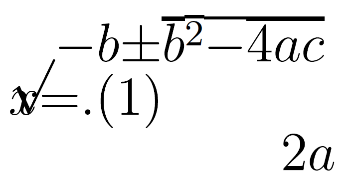

# Plan

-   Why worry about maths access?
-   What is the maths specific problem?
-   What do solutions look like?
-   How do you get started?

Live document: <https://stem-enable.github.io/Quick-introduction-to-accessible-maths-2026/>

# Why worry about maths[^1] access?


## The legal

Accessibility is a legal requirement... I am not a lawyer[^2]. Seek advice.

-   Equal access:
    -   England, Scotland, Wales: [Equality Act 2010](https://www.legislation.gov.uk/ukpga/2010/15/contents)
    -   Northern Ireland: [Disability Discrimination Act 1995, (as amended), including SENDO 2005](http://www.niassembly.gov.uk/globalassets/Documents/RaISe/Publications/2012/ofmdfm/2712.pdf)
    -   Ireland: [Equal Status Acts 2000 - 2018](https://www.ihrec.ie/app/uploads/2022/08/IHREC-Equal-Status-Rights-Leaflet-WEB.pdf)
-   Accessible digital content (including university websites, web services and most VLE content):
    -   UK: [Public Sector Bodies (Websites and Mobile Applications) (No. 2) Accessibility Regulations 2018](https://www.legislation.gov.uk/uksi/2018/952/contents)
    -   Ireland: [European Union (Accessibility of Websites and Mobile Applications of Public Sector Bodies) Regulations 2020](https://www.irishstatutebook.ie/eli/2020/si/358/made/en/print)

## But we should care anyway...

**We want** students to spend their effort engaging with concepts, not overcoming barriers in our resources.

Students with print disabilities or difficulties with reading, note-taking, memory or concentration may expend significant effort accessing information before learning can begin.

**As educators, we should make information accessible in multiple ways.**

-   Rich, interactive resources can benefit all students.
-   Poorly designed resources create practical and technical barriers:
    -   Notation inaccessible via speech, magnification, Braille or small screens
    -   Difficult keyboard-only navigation
    -   Meaning conveyed by colour alone
    -   Poorly scalable graphics

# What is the maths specific problem?

## Structured text can be unexpectedly inaccessible

::: {style="display: flex; justify-content: center;"}
::::{.content-hidden unless-meta="video"}

::::
::::{.content-visible unless-meta="video"}
\label{video}](./Figs/Acrobat-thumbnail.png){width="60%" longdesc="https://www.youtube.com/watch?v=mgpo23i76O0"}
::::
:::

## Could we solve it by...?

Can we not solve this by ensuring that the PDF is accessible? Unfortunately, the answer is currently, not yet[^4]. In current software and typically in-use PDF standards, the act of creating the PDF destroys the structure of mathematical, and similar, expressions. Reflow on a small screen produces...

{width="40%" fig-align="center" fig-alt="Jumbled mess of elements of the quadratic equation with the fraction structure and square root structure completely destroyed." }

# What do solutions look like?

## Structure + software

Being able to adapt how text is presented, whether for small screens or via assistive software requires:

-   Authors to produce accessible materials which maintains the encoding of the structured text
-   Readers to have software and assistive technology which can manipulate the specific format

Until all this work is finished for PDF, only four formats of mathematical text are technically accessible:

-   HTML using MathJax to render the mathematics
-   Word/PowerPoint using the inbuilt equation editor
-   Word/PowerPoint using MathType
-   EPub3 using MathML

You **must** supply at least one to meet the public bodies requirement.

-   Supply your full course content 'spine' in this format.


## So, job done? {.allowframebreaks}

Afraid not... 

Not all reader assistive technology can access maths in all formats! 

-   Equal access acts mean we must meet individual needs - so may need to produce other formats. 
-   Some formats cannot not be transformed easily to others

For authors using Word/PowerPoint, standard accessiblity guidance is not enough. 

For authors using the LaTeX scientific document preparation system none of the above formats are native outputs. **And** if a student can't make their own clear print **and print it** you also may need to supply variants on inaccessible PDF!

-   Not all accessibility is about technical access
-   Clear print[^3] PDF is selected most often by disabled students in the Department of Mathematical Sciences at the University of Bath[^5].

# How do you get started? 

## Word/PowerPoint 365

-   Use the inbuilt Accessibility Checker and information on e.g. [Making your Word documents accessible](https://support.office.com/en-gb/article/make-your-word-documents-accessible-to-people-with-disabilities-d9bf3683-87ac-47ea-b91a-78dcacb3c66d)
-   Write ***all*** mathematical text written using the MS 365 equation editor. E.g. if you are writing about the variable ($x$) or ($\theta$) it should be written as an equation. If you are writing ($x^2$) it should be written as an equation.
    -   Never use insert symbol.
    -   Never write superscripts, subscripts, fractions etc. using font or style changes and standard keyboard input alone
    -   Never use an image of an equation.
-   Use Review -\> Read Aloud (Alt + Ctrl + Space) to check the maths
  - [Quick example](./example.docx)

## Word/PowerPoint transforms and tools


- [Effective (keyboard-only) input of maths in Word](https://bathmash.github.io/gettingstarted/Word/index.html).
- [Central Access Reader](https://www.cwu.edu/student-life/student-support/central-access/resources/reader.php)
  - Transforms to specially set up HTML for screenreaders
  - Can output MP3
  - Can be used as text to speech software (but is not screenreader compatible) 
- [Transform to MathType](https://www.wiris.com/en/mathtype/office-tools/)
  - Student can convert to MathType - supply standard format
  - Conversion back to Word is not possible in bulk

At the time of writing transforming from (any) PowerPoint is tricky. Best not to use this as a source format. If making slides, I would use Quarto (used to make this!).

## HTML (WCAG 2.2 AA) + MathJax!

-   Check it meets the legal requirement of WCAG 2.2 Level AA with e.g. [Accessibility Insights for Web plugin for Chrome](https://accessibilityinsights.io/docs/en/web/overview)

-   Check it is MathJax... Right click! $$x = \frac{-b\pm\sqrt{b^2 - 4ac}}{2a}$$

    -   Provides/enables: navigation, chunking, zoom, copy/paste, colour, size and layout changes...
    -   Encoded structure enables assistive technology including text-to-speech, screenreaders, electronic Braille
    -   Fallback for ARIA-aware AT without native support
    -   AT providers without native support and not ARIA aware are a problem but not your problem.

We recommend using MathJax 2.7.9 or [MathJax 4.* as MathJax 3.* does not enable reflow on zoom](https://docs.mathjax.org/en/v4.0/output/linebreaks.html) (a requirement for WCAG 2.2 AA). 

## Scientific document preparation systems {.allowframebreaks}

-   Attempt to transform the LaTeX[^6] to HTML with MathJax using [Chirun](https://chirun.org.uk/), [BookML](https://vlmantova.github.io/bookml/) or [lwarp](https://ctan.org/pkg/lwarp?lang=en)
    -   What happens depends on what you are doing in LaTeX
    -   Keep your preamble **clean**, start with a minimal document, add in sections recompiling to all required output formats after each addition
    -   Some documents cannot be converted
    -   **I don't know of a Beamer solution** at time of writing
-   Work in a Markdown format, using LaTeX for equations, with HTML has the primary output (can also output LaTeX/PDF); can create slides and single-source slides and documents (like Beamer)
    - [Quarto](https://quarto.org/) is recommended in most cases
      - [Bookdown](https://bookdown.org/) continues to be fine but start new projects in Quarto
    - [RMarkdown](https://rmarkdown.rstudio.com/) can be a helpful starting point for those completely new
    - [Clavertondown](https://bathmash.github.io/clavertondown/), built using RMarkdown and Bookdown; only if other methods can't meet needs

::: {.content-visible when-format="beamer"}
```{=latex}
\quad
```
:::
  
## Non-text elements

- Graphical elements
  -   [Desmos was designed to work and tested with screenreaders and written to conform to WCAG 2.1](https://www.desmos.com/accessibility)
  -   [Geogebra aims to meet WCAG 2.1 AA](https://www.geogebra.org/m/r2EF8uRx)
    -   [Project **Beyond alt text** between Bath and Coventry produced guidelines](https://bathmash.github.io/CETL-MSOR-2022-Beyond-alt-text/index.html)
  -   [BrailleR](https://github.com/ajrgodfrey/BrailleR) is a project by and for [blind statisticians who use R](https://r-resources.massey.ac.nz/BrailleR/)
  -   [DIAGRAM Center](http://diagramcenter.org/) has some great resources for those new to diagram description:
      -   Poet Image Description Training Tool
      -   Image description guidelines
      -   Sample book
      -   [Webinar on complex images](http://diagramcenter.org/diagramwebinars.html#compleximages)
- Maths e-assessment
  -   [Numbas aims to meet WCAG 2.1 AA](https://docs.numbas.org.uk/en/latest/accessibility/editor.html)
  -   [Stack aims to meet WCAG 2.1 AA](https://stack-assessment.org/Legal/Accessibility/)

# Next steps

The ideal can feel a long way off... 

- Pick a place to start which feels achievable and start! 
- The journey is less lonely if we share experiences and learn from each other
    - Consider setting up an institution community of practice, after 6 years our Markdown/Bookdown/ClavertonDown/Quarto CoP answers many questions between themselves without help from me, my team or the specialist STEM learning technologists (who we are very lucky to have)
    - In the UK there is the [JISC Accessibility Community Maths Working Group](https://sites.google.com/view/accessible-maths/home). 
      - Is there anything similar in Ireland?
      - It may be worth exploring whether links can be made with them from Ireland

Want to see how I built this single-source, multiple-outputs document? [Github repository source - see qmd file](https://github.com/STEM-Enable/Quick-introduction-to-accessible-maths-2026/)

:::{.content-hidden unless-meta="notes"}
Here is some text which is only included in the notes formats!

- To prove it is possible to create slides and notes from one source
- You will find this part only in the html document and the Word format, not in any of the slide formats
:::

[^1]: I will use the word maths as a shorthand for all mathematical and statistical content used across any STEM degree. Although I won't be talking about specialist chemical notations and diagrams the same issues apply. 

[^2]: Legislation is cited for awareness only and this does not constitute legal advice. Specific legal questions should be referred to your University legal team.

[^3]: Adhering as closely as possible to RNIB clear print guidelines

[^4]: Work is ongoing to add encoding within a new PDF standard (PDF/UA-2 and WTPDF (Well-Tagged PDF) standards), [create a version of LaTeX which can do this](https://latex3.github.io/tagging-project/) (itself, a multi-year project [currently in stage 4 of enabling package authors to apply changes](https://latex3.github.io/tagging-project/documentation/)), **and** software which works with the extra encoding. The assistive technology vendors would then also need to support all of this. In the meantime we need to either convert the LaTeX to other formats or switch to a different scientific document preparation system. 

[^5]: Last year we had to assist an author to create a printable PDF for a disabled student after the author had made a whole (and completely technically accessible) course using ProTeXt - but couldn't get PDF working and the HTML produced poor print output...

[^6]: It is **not possible** to convert LaTeX to html in the general case. It is easy to 'fall out' of the convertible subset without realising or knowing why, the addition of a package, change of preamble order, use of a seemingly innocent command...
